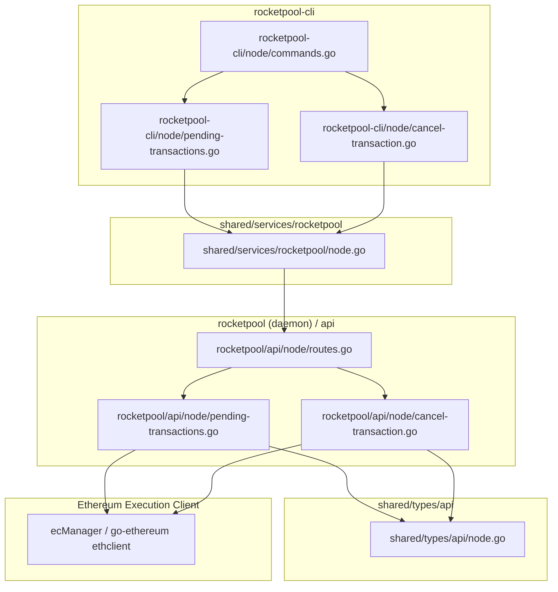

# Research & Design Specification: Pending Transaction Management (Issue #351)

**Issue**: [rocket-pool/smartnode#351: [FEATURE REQUEST] Command to check/cancel the node's pending txs](https://github.com/rocket-pool/smartnode/issues/351)  
**Target Project Directory**: `/mnt/data/Projects/smartnode`

---

## 1. Problem Statement & Motivation

Rocket Pool node operators frequently encounter stuck transactions in the mempool due to sudden network base fee or priority fee spikes after submitting on-chain operations (such as minipool staking, RPL rewards claiming, fee distributor distribution, or setting withdrawal addresses).

### 1.1 Root Causes
1. **Ethereum Nonce Serialization**: Ethereum strictly processes transactions from a given address in strictly increasing nonce order ($0, 1, 2, \dots$). If transaction $N$ has a gas price below the miner/validator inclusion threshold, all subsequent transactions $N+1, N+2, \dots$ are queued behind it and will never execute until transaction $N$ is mined or cancelled.
2. **Current Workaround Friction**: Node operators must currently:
   - Open Etherscan or another block explorer to locate their node wallet address.
   - Inspect the pending transaction to identify the stuck nonce and gas parameters.
   - Manually formulate a replacement transaction using CLI flags (`--nonce <N>`, `--maxPrioFee <higher_fee>`).
   - Calculate replacement fees (Ethereum clients enforce a $\ge 10\%$ increase in priority fee and max fee over the pending transaction).
   - Repeat sequentially if multiple transactions are backed up.
3. **Error Risks**: Node operators can easily miscalculate replacement fees leading to `replacement transaction underpriced` RPC errors, or accidentally send invalid transactions.

---

## 2. Functional Requirements

### 2.1 Feature 1: Check Pending Transactions
* **CLI Command**: `rocketpool node pending-transactions` (aliases: `pending-txs`, `pending`, `txs`)
* **Functionality**:
  - Compares the on-chain mined nonce (`latest`) against the mempool pending nonce (`pending`).
  - Lists the count of pending transactions.
  - Formats a table displaying the stuck nonces, estimated gas parameters, and action suggestions.

### 2.2 Feature 2: Cancel / Overwrite Pending Transactions
* **CLI Command**: `rocketpool node cancel-transaction` (aliases: `cancel-tx`, `cancel`)
* **Flags**:
  - `--nonce, -n <uint>`: Specific nonce to cancel (defaults to the lowest pending nonce, which is the primary blocker).
  - `--all, -a`: Batch cancels all pending nonces in sequential ascending order.
  - `--yes, -y`: Automatically confirm prompts.
* **Mechanism**:
  - Submits a 0-ETH self-transfer (`from == to == nodeAddress`, empty `data = []`, gas limit `21,000`).
  - Applies a calculated gas bump ($\ge 15\%$ above previous priority fee or current network base fee + priority fee, whichever is higher).
  - Waits for confirmation and reports status to the user.

---

## 3. System Architecture & Components



---

## 4. Implementation Details by Component

### 4.1 Data Models (`shared/types/api/node.go`)
```go
// NodePendingTransactionsResponse contains the pending status of the node
type NodePendingTransactionsResponse struct {
	APIResponse
	NodeAddress         common.Address     `json:"nodeAddress"`
	LatestNonce         uint64             `json:"latestNonce"`
	PendingNonce        uint64             `json:"pendingNonce"`
	PendingCount        uint64             `json:"pendingCount"`
	PendingTransactions []PendingTxDetails `json:"pendingTransactions"`
}

type PendingTxDetails struct {
	Nonce          uint64          `json:"nonce"`
	Hash           *common.Hash    `json:"hash,omitempty"`
	To             *common.Address `json:"to,omitempty"`
	Value          *big.Int        `json:"value,omitempty"`
	GasLimit       uint64          `json:"gasLimit"`
	MaxFeePerGas   *big.Int        `json:"maxFeePerGas,omitempty"`
	MaxPriorityFee *big.Int        `json:"maxPriorityFeePerGas,omitempty"`
	IsStuck        bool            `json:"isStuck"`
}

type CanCancelNodeTransactionResponse struct {
	APIResponse
	CanCancel           bool    `json:"canCancel"`
	Nonce               uint64  `json:"nonce"`
	GasLimit            uint64  `json:"gasLimit"`
	MinPriorityFeeGwei  float64 `json:"minPriorityFeeGwei"`
	SuggestedMaxFeeGwei float64 `json:"suggestedMaxFeeGwei"`
}

type CancelNodeTransactionResponse struct {
	APIResponse
	TxHash common.Hash `json:"txHash"`
}
```

### 4.2 Daemon API Routes & Handlers (`rocketpool/api/node/`)

1. **`rocketpool/api/node/routes.go`**:
   Register endpoints via `snroute`:
   - `snroute.Read("/api/node/pending-transactions", pendingTransactionsHandler).RegisterTo(router)`
   - `snroute.Read("/api/node/can-cancel-transaction", canCancelTransactionHandler).RegisterTo(router)`
   - `snroute.Write("/api/node/cancel-transaction", cancelTransactionHandler).RegisterTo(router)`

2. **`rocketpool/api/node/pending-transactions.go`**:
   - Query `latestNonce, err := ec.NonceAt(ctx, nodeAddress, nil)`
   - Query `pendingNonce, err := ec.PendingNonceAt(ctx, nodeAddress)`
   - If `pendingNonce > latestNonce`, assemble the range $[\text{latestNonce}, \text{pendingNonce}-1]$.
   - Tiered enrichment: Query `txpool_contentFrom` on EC; if supported, extract transaction hashes, destinations, and gas prices.

3. **`rocketpool/api/node/cancel-transaction.go`**:
   - Preflight: verify `nonce >= latestNonce` (supporting evicted txs where `pendingNonce == latestNonce`), verify wallet is loaded and not in observe mode, and verify ETH balance covers gas.
   - Prepare a 0-ETH transaction to `nodeAddress` with empty data payload and fixed 21,000 gas limit.
   - Calculate replacement fees: $\ge 15\%$ bump over previous fee if known, or market-based $2 \times \text{BaseFee} + \text{Tip}$ buffer.
   - Sign with `opts.Signer` and broadcast via `ec.SendTransaction()`.

### 4.3 Client Methods (`shared/services/rocketpool/node.go`)
- `(c *Client) NodePendingTransactions() (api.NodePendingTransactionsResponse, error)`
- `(c *Client) CanCancelNodeTransaction(nonce uint64) (api.CanCancelNodeTransactionResponse, error)`
- `(c *Client) CancelNodeTransaction(nonce uint64) (api.CancelNodeTransactionResponse, error)`

### 4.4 CLI Subcommands (`rocketpool-cli/node/`)
- `rocketpool-cli/node/commands.go`: Register `pending-transactions` (aliases: `pending-txs`, `pending`, `txs`) and `cancel-transaction` (aliases: `cancel-tx`, `cancel`).
- `rocketpool-cli/node/pending-transactions.go`: Tabulated display of stuck nonces, fees, hashes, and actionable cancel guidance.
- `rocketpool-cli/node/cancel-transaction.go`: Interactive confirmation, gas summary, single / batch execution, and transaction tracking with `rp.WaitForTransaction()`.

---

## 5. Edge Cases & Safety Matrix

| Scenario | Behavior |
| :--- | :--- |
| **No pending transactions in pool (`pendingNonce == latestNonce`)** | Inform the user; allow explicit `--nonce <N>` override if $N \ge \text{latestNonce}$ to cancel an evicted transaction. |
| **Evicted / Dropped transaction** | If an underpriced transaction was dropped from the local EC mempool, operator can specify `--nonce <N>` to overwrite it on network/relays. |
| **Insufficient ETH for gas** | `can-cancel-transaction` verifies node ETH balance $\ge 21,000 \times \text{suggestedMaxFee}$ and warns operator before submitting. |
| **Cancelling out-of-order nonce** | Warn user if cancelling nonce $> \text{latestNonce}$ while lower nonces remain stuck; prioritize the lowest nonce first. |
| **Replacement Underpricing** | Calculate minimum 15% priority fee bump over known tx or default $2 \times \text{BaseFee} + \text{Tip}$. |
| **Observe Mode (Cold / HW Wallet)** | Fail early with clean error: observe mode cannot sign or submit transactions. |
| **Multiple Pending Transactions (`--all`)** | Execute sequentially: cancel $N$, wait for block inclusion, then proceed to $N+1$ to prevent nonce collisions. |
